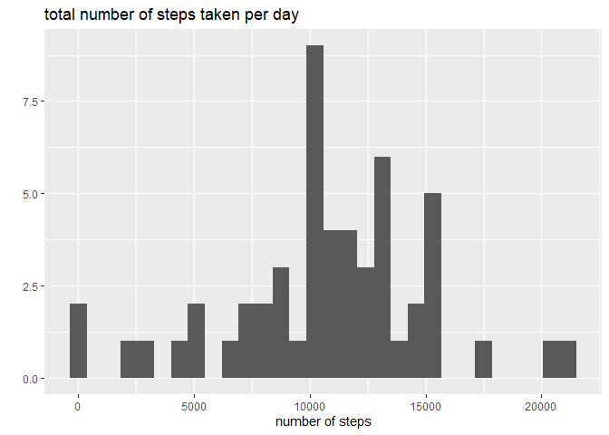
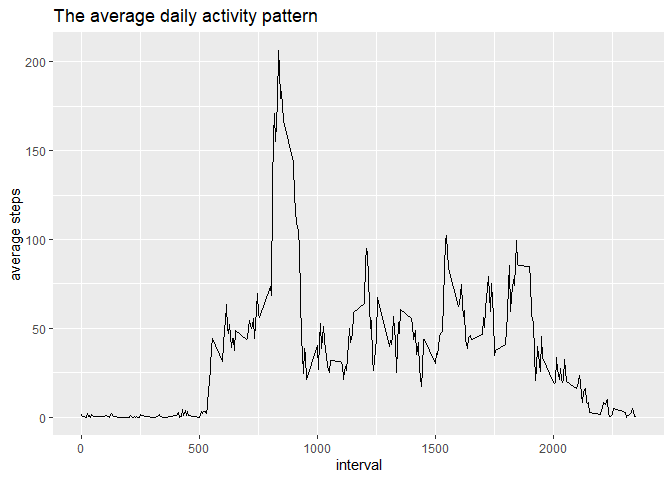
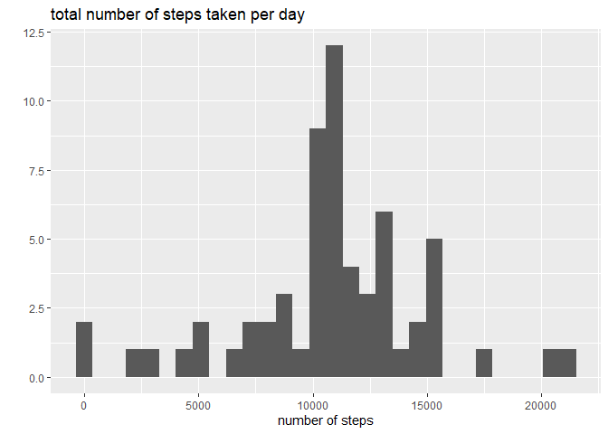
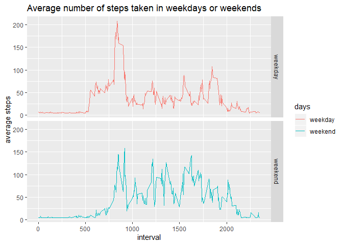

### Loding important libraries

```r
library(dplyr)
```

```
## 
## Attaching package: 'dplyr'
```

```
## The following objects are masked from 'package:stats':
## 
##     filter, lag
```

```
## The following objects are masked from 'package:base':
## 
##     intersect, setdiff, setequal, union
```

```r
library(ggplot2)
```


## Loading and preprocessing the data
Load Processed/transformed data (if necessary) into a format suitable for your analysis.

```r
df <- read.csv("activity.csv", na.strings = "NA", header = T)
df$date <- as.Date(as.character(df$date)) # convert date column type.
```


## What is mean total number of steps taken per day?
1. Make a histogram of the total number of steps taken each day

```r
daily <- df %>% group_by(date) %>% na.omit() %>%
    summarise(totalSteps = sum(steps))
qplot(daily$totalSteps, bins = 30, xlab = "number of steps",
      main = "total number of steps taken per day")
```

<!-- -->

2. Calculate the total number of steps taken per day

```r
mean(daily$totalSteps)
```

[1] 10766.19

```r
median(daily$totalSteps)
```

[1] 10765


## What is the average daily activity pattern?
1. Make a time series plot

```r
intervally <- df %>% group_by(interval) %>% na.omit() %>%
    summarise(avgSteps = mean(steps))
qplot(x = interval, y = avgSteps, data = intervally, geom = 'line',
      ylab = "average steps",
      main = "The average daily activity pattern")
```

<!-- -->

2. Which 5-minute interval, on average across all the days in the dataset, contains the maximum number of steps?

```r
intervally[which(intervally$avgSteps== max(intervally$avgSteps)),]
```

# A tibble: 1 x 2
  interval avgSteps
     <int>    <dbl>
1      835     206.


## Imputing missing values
1. Calculate and report the total number of missing values in the dataset (i.e. the total number of rows with NAs)

```r
sum(is.na(df))
```

[1] 2304

2. Create a new dataset that is equal to the original dataset but with the missing data filled in.

```r
imputedDF <- df %>% replace(is.na(df), mean(df$steps, na.rm = T))
sum(is.na(imputedDF))
```

[1] 0

3. Make a histogram of the total number of steps taken each day and Calculate and report the mean and median total number of steps taken per day.

```r
daily_imputed <- imputedDF %>% group_by(date) %>% na.omit() %>%
    summarise(totalSteps = sum(steps))
qplot(daily_imputed$totalSteps, bins = 30, xlab = "number of steps",
      main = "total number of steps taken per day")
```

<!-- -->

4. Compare the mean and median of Old and New data

```r
old_mean <- mean(daily$totalSteps)
print(old_mean)
```

[1] 10766.19

```r
new_mean <- mean(daily_imputed$totalSteps)
print(new_mean)
```

[1] 10766.19

```r
old_median <- median(daily$totalSteps)
print(old_median)
```

[1] 10765

```r
new_median <- median(daily_imputed$totalSteps)
print(new_median)
```

[1] 10766.19


## Are there differences in activity patterns between weekdays and weekends?
1. Create a new factor variable in the dataset with two levels – “weekday” and “weekend” indicating whether a given date is a weekday or weekend day.

```r
imputedDF$days <- weekdays(imputedDF$date)
imputedDF$days <- ifelse(imputedDF$days=="Saturday" | imputedDF$days=="Sunday", "weekend", "weekday")
table(imputedDF$days)
```


weekday weekend 
  12960    4608 

2. Make a panel plot containing a time series plot of the 5-minute interval

```r
imputedDF <- imputedDF %>% group_by(interval, days) %>%
    summarise(avgSteps = mean(steps))
ggplot(data = imputedDF, aes(x=interval, y=avgSteps, color=days)) + 
    geom_line() + facet_grid(days ~ .) + xlab("interval") +
    ylab("average steps") +
    ggtitle("Average number of steps taken in weekdays or weekends")
```

<!-- -->
